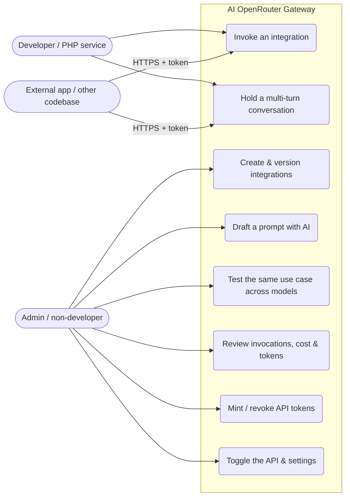
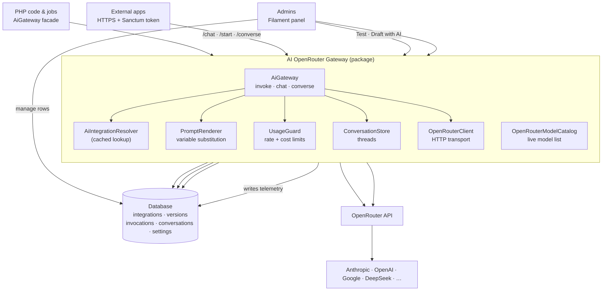
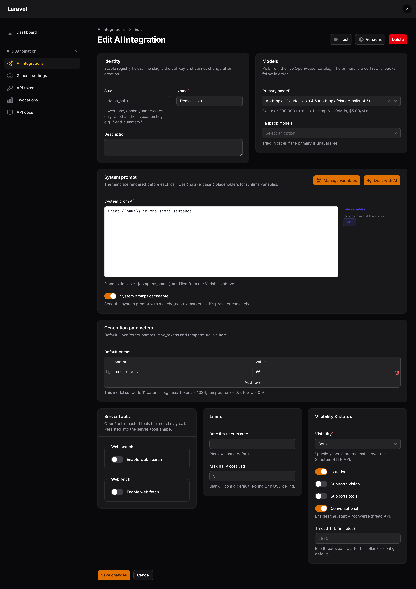
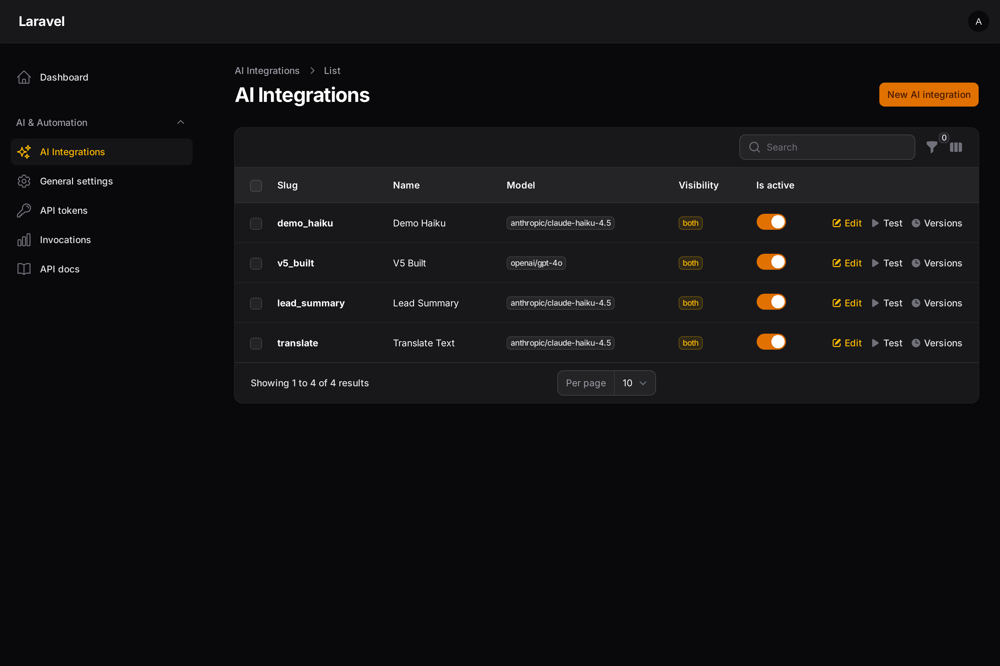
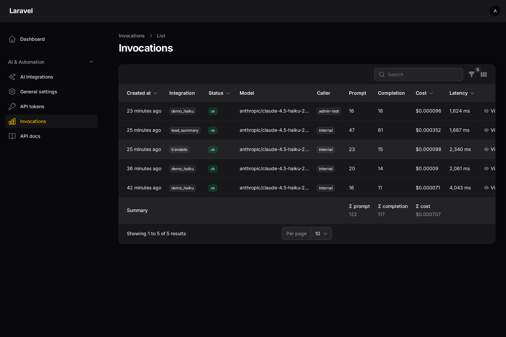
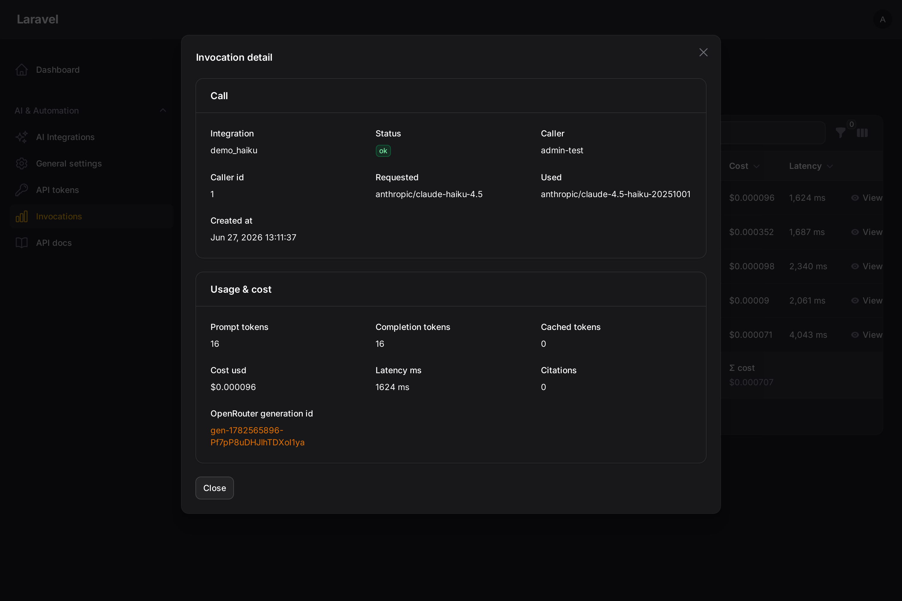
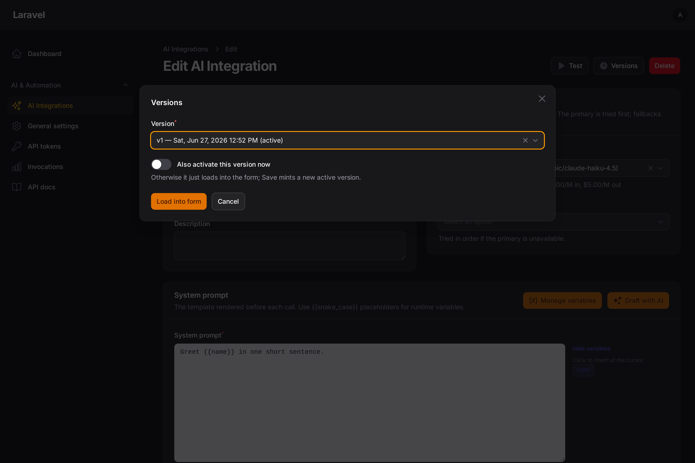
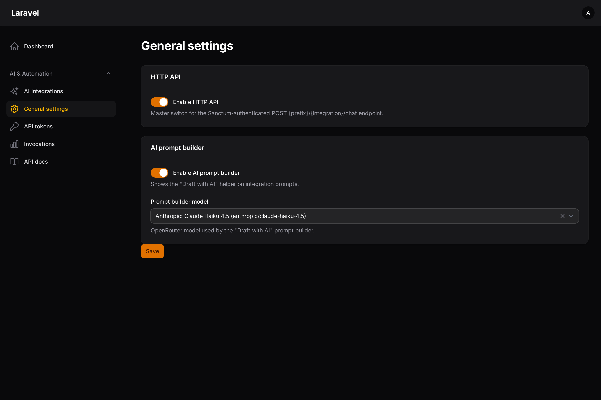
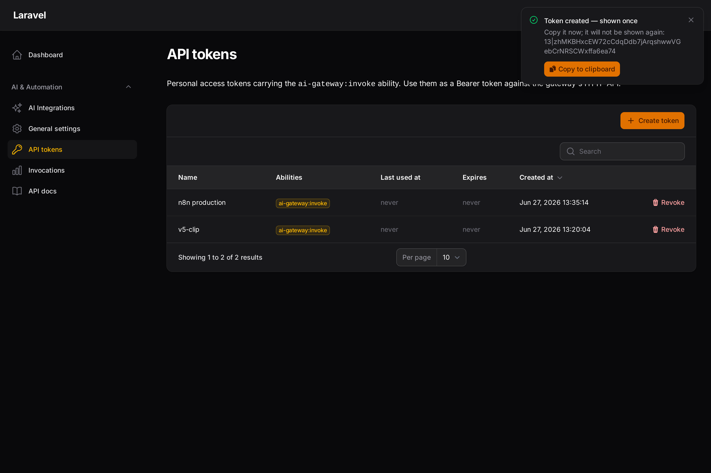
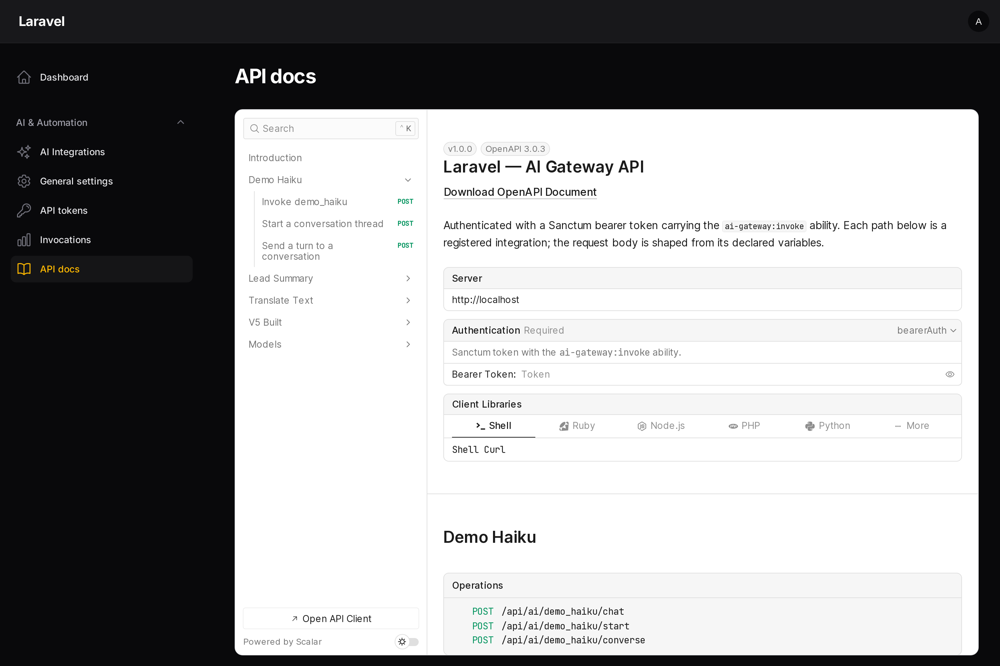

# AI OpenRouter Gateway for Laravel

[](https://packagist.org/packages/andrecorugda/ai-openrouter-gateway)
[](https://packagist.org/packages/andrecorugda/ai-openrouter-gateway)
[](https://github.com/andrecorugda/ai-openrouter-gateway/actions)
[](https://packagist.org/packages/andrecorugda/ai-openrouter-gateway)
[](LICENSE)

**Manage every AI feature in your Laravel app as a versioned, runtime-tunable integration — one OpenRouter key for every model, behind one service, one audit log, and one cost view.**

Stop hardcoding prompts and model ids. Define a use case once, then tune its prompt, model, and parameters from a bundled **Filament** admin UI — no code change, no redeploy. Call it from PHP or over an authenticated HTTP API, with multi-turn conversations, rate limits, daily cost caps, and per-call telemetry built in.

```php
use Andre\AiGateway\Facades\AiGateway;

$result = AiGateway::invoke('lead_summary', ['company' => 'Acme Corp']);

$result->text;        // the model's reply
$result->model_used;  // 'anthropic/claude-sonnet-4'
$result->cost_usd;    // 0.0004
```

Swap `anthropic/claude-sonnet-4` for `openai/gpt-4o` or `google/gemini-2.5-pro` from a dropdown — every model OpenRouter offers, no code change.

> Your prompts, customer data, and OpenRouter key never leave your app — there's no third-party SaaS in the trust boundary.

---

## Why?

- **No hardcoded prompts.** Prompt, variables, model, and params live in the database and the admin UI — not your source tree.
- **Tune in production, instantly.** Edit and save; the next call uses it. Every save mints a new **version** you can roll back to.
- **Test across models in seconds.** Pick any model from the live catalog, hit **Test**, and compare output, tokens, latency, and cost — then promote the better or cheaper one.
- **One use case, every caller.** Invoke it from any PHP service *and* any external app or language over HTTPS — one source of truth, reused across platforms.
- **Spend you can see and cap.** Per-call cost / token / latency telemetry, plus per-integration rate limits and daily budgets.

---

## How it works

### Who uses it (use cases)



### Architecture



**Request flow (one call):** resolve the integration's active version (cached) → render the prompt template with the caller's args → enforce rate + daily-cost limits → compose the OpenRouter payload (model[s], params, server tools, optional cache markers) → call OpenRouter → write an `ai_invocations` telemetry row (cost / tokens / latency / status) → return a typed `AiResult`. Conversational calls additionally load and persist thread turns via `ConversationStore`.

---

## Features

- 🔌 **One key, every model** — OpenRouter under the hood; switch models per-integration with no code change.
- 🧩 **Named integrations** — register a use case once, invoke it by slug everywhere.
- 🗂️ **Versioned prompts** — every edit mints a new version; activate/roll back without losing history.
- 🧮 **Telemetry built in** — tokens, cost, latency, model, and status for every call in `ai_invocations`.
- 🚦 **Rate limiting** — per-integration, per-caller, per-minute.
- 💰 **Cost limiting** — per-integration daily USD budget, enforced before each call.
- 🌐 **HTTP API** — `POST /api/ai/{integration}/chat`, Sanctum-authenticated, toggleable at runtime.
- 💬 **Conversation threads** — opt-in multi-turn memory with `/start` + `/converse`, per-caller ownership, TTL expiry, and a prune command.
- 📖 **Live API docs** — an OpenAPI 3 spec + interactive Scalar "try it" page generated from your integrations.
- 🔑 **API token management** — mint and revoke scoped tokens from the admin UI.
- 🔎 **OpenRouter server tools** — per-version `web_search` / `web_fetch`.
- ✨ **AI prompt builder** — describe what you want; a fast Haiku drafts the template + variables.
- 🗂️ **Live model catalog** — searchable model picker from OpenRouter's `/models`, with per-model generation params and caching eligibility.
- 📊 **Invocations browser** — read-only telemetry with status/caller/date filters, cost + token Σ summaries, and per-call detail.
- 🎛️ **Filament admin UI** — integration CRUD, versions (load-into-form), a live test panel, an interactive prompt editor, settings.
- ⚙️ **Fully configurable** — connection, table names, route prefix/middleware, cache store, limits, models.

## Requirements

- PHP 8.2+
- Laravel 11, 12, or 13
- An [OpenRouter](https://openrouter.ai) API key
- **Filament 4 or 5** for the admin UI *(optional)* — see version compatibility below

## Version compatibility

| Package | Filament |
|---|---|
| `^2.0` | **4.x / 5.x** |
| `^1.0` | **3.x** |

Composer installs the right line for your Filament version automatically — `composer require andrecorugda/ai-openrouter-gateway`.

## Installation

```bash
composer require andrecorugda/ai-openrouter-gateway
```

Publish and run the migrations:

```bash
php artisan vendor:publish --tag="ai-openrouter-gateway-migrations"
php artisan migrate
```

Optionally publish the config:

```bash
php artisan vendor:publish --tag="ai-openrouter-gateway-config"
```

Add your key to `.env`:

```env
OPENROUTER_API_KEY=sk-or-v1-...
```

That's the only required variable — referer/title default to your `APP_URL` / `APP_NAME`.

## Quickstart

### 1. Create an integration

Either through the Filament UI (recommended) or in code:

```php
use Andre\AiGateway\Models\AiIntegration;
use Andre\AiGateway\Services\AiIntegrationService;

$integration = AiIntegration::create([
    'slug' => 'expense_extract',
    'name' => 'Expense Extractor',
    'visibility' => 'internal',
]);

app(AiIntegrationService::class)->saveVersion($integration, [
    'system_prompt' => 'Extract the merchant, total, and date from this receipt:\n\n{{receipt_text}}',
    'models' => ['anthropic/claude-sonnet-4', 'openai/gpt-4o'], // primary + fallback
    'default_params' => ['max_tokens' => 512, 'temperature' => 0.1],
    'prompt_args' => [
        ['name' => 'receipt_text', 'type' => 'string', 'required' => true],
    ],
]);
```

### 2. Invoke it from PHP

```php
use Andre\AiGateway\Facades\AiGateway;

$result = AiGateway::invoke('expense_extract', [
    'receipt_text' => $ocrText,
]);

$result->text;        // the assistant's reply
$result->model_used;  // 'anthropic/claude-sonnet-4'
$result->cost_usd;    // 0.0021
$result->usage;       // ['prompt_tokens' => ..., 'completion_tokens' => ...]
```

Multi-turn chat layers messages on top of the templated system prompt:

```php
$result = AiGateway::invoke('support_assistant',
    args: ['kb_version' => 'v3'],
    messages: [
        ['role' => 'user', 'content' => 'How do I reset my password?'],
    ],
);
```

### 3. Or call it over HTTP

The HTTP API and the **API Tokens** admin page are authenticated with
[Laravel Sanctum](https://laravel.com/docs/sanctum). One-time setup in your app:

```bash
composer require laravel/sanctum
php artisan migrate            # creates personal_access_tokens
```

Then add the `HasApiTokens` trait to your `User` model:

```php
use Laravel\Sanctum\HasApiTokens;

class User extends Authenticatable
{
    use HasApiTokens;
    // ...
}
```

Now call the endpoint:

```bash
curl -X POST https://your-app.test/api/ai/expense_extract/chat \
  -H "Authorization: Bearer <token>" \
  -H "Content-Type: application/json" \
  -d '{"args": {"receipt_text": "..."}, "options": {"max_tokens": 256}}'
```

Mint the token from the admin UI (**API Tokens** page — with an optional expiry of 7/30/90 days or 1 year) or in code:

```php
// never expires
$token = $user->createToken('integration-client', ['ai-gateway:invoke'])->plainTextToken;

// expires in 30 days — Sanctum rejects it automatically after that
$token = $user->createToken('integration-client', ['ai-gateway:invoke'], now()->addDays(30))->plainTextToken;
```

Sweep expired tokens from the table on a schedule with Sanctum's built-in command:

```php
// routes/console.php
Schedule::command('sanctum:prune-expired --hours=24')->daily();
```

## The admin UI (Filament)

Register the plugin on your panel:

```php
use Andre\AiGateway\Filament\AiGatewayPlugin;

public function panel(Panel $panel): Panel
{
    return $panel
        // ...
        ->plugin(AiGatewayPlugin::make());
}
```

You get:

- **AI Integrations** — create/edit integrations with a **searchable model picker from the live OpenRouter catalog**, **generation params that auto-populate per model**, a **model-aware prompt-caching** control, an **interactive prompt editor** (click a declared variable to insert `{{name}}`), a **Versions** action that loads any past version back into the form, and a **Test** panel that runs it live and shows tokens/cost/latency.
- **Draft with AI** — describe the use case in plain language; the prompt builder fills the template and variable schema for you.
- **Invocations** — a read-only telemetry browser: filter by status / caller / integration / date, with cost + token Σ summaries and a per-call detail modal (usage, error, OpenRouter generation link).
- **General settings** — toggle the HTTP API, toggle the prompt builder, and pick the helper model (also a catalog-backed Select).
- **API Tokens** — mint (with an optional expiry) and revoke scoped invocation tokens; the one-time token has a one-click **Copy to clipboard** button.
- **API docs** — the interactive OpenAPI (Scalar) reference embedded right in the panel; browse and test every integration's endpoints without leaving Filament.

### Screenshots

| | |
|---|---|
| **Integration form** — catalog model picker, per-model params, caching, prompt editor |  |
| **Integrations list** |  |
| **Invocations** — telemetry with Σ summaries |  |
| **Invocation detail** — per-call tokens, cost, latency, OpenRouter id |  |
| **Versions** — load a past version into the form |  |
| **General settings** |  |
| **API tokens** — mint scoped tokens; one-time value with one-click copy |  |

## Conversations (multi-turn threads)

Flag an integration **conversational** (UI toggle, or `is_conversational` + `conversation_ttl_minutes`) to get server-side memory: the gateway persists each turn, so clients send only the next message — no replaying history.

From PHP:

```php
use Andre\AiGateway\Facades\AiGateway;

$first  = AiGateway::converse('support', null, 'My order is late');      // null → new thread
$id     = $first->conversation_id;                                       // keep this
$second = AiGateway::converse('support', $id, 'Order #4471');            // continues with full history
```

Over HTTP (two calls, à la a chatbot `/start` then `/chat`):

```bash
# 1) open a thread
curl -X POST https://your-app.test/api/ai/support/start \
  -H "Authorization: Bearer <token>"
# → { "data": { "conversation_id": "0779…", "expires_at": "…" } }

# 2) send turns
curl -X POST https://your-app.test/api/ai/support/converse \
  -H "Authorization: Bearer <token>" -H "Content-Type: application/json" \
  -d '{"conversation_id": "0779…", "message": "Order #4471"}'
```

Threads are owned by their caller (a guessed id returns 404), expire after the TTL, and link each turn to its telemetry row. Prune expired threads on a schedule:

```php
// routes/console.php
Schedule::command('ai-gateway:prune-conversations')->daily();
```

## Interactive API docs

The package serves a **live OpenAPI 3 document built from your integrations**, plus an interactive **[Scalar](https://scalar.com)** docs page with a built-in request tester:

- `GET {prefix}/docs` — the docs UI (paste a token, try any endpoint live)
- `GET {prefix}/openapi.json` — the raw spec
- **…and as an "API docs" page right inside the Filament panel** (embedded, so admins never leave the UI)

Every API-visible integration becomes real endpoints: `POST /{slug}/chat` with a request body shaped from its **declared variables** (types + required flags) and the allow-listed `options`, plus `/{slug}/start` and `/{slug}/converse` when the integration is **conversational**. The model and prompt-caching mode appear in each endpoint's description.



Gate or disable it via `config('ai-gateway.api.docs')` — add `middleware` (e.g. `['auth']`) to make it private, or override `script_src` to self-host the renderer instead of the CDN.

## Rate & cost limiting

Set ceilings per integration (UI → Limits, or the `rate_limit_per_minute` / `max_daily_cost_usd` columns). Blank falls back to the config default; a `null` default means unlimited.

```php
// config/ai-gateway.php
'rate_limit' => [
    'enabled' => true,
    'default_per_minute' => 60,   // null = unlimited
],
'cost_limit' => [
    'enabled' => true,
    'default_daily_usd' => 25.0,  // null = uncapped
    'window_hours' => 24,
],
```

When a caller exceeds a limit the gateway throws `RateLimitExceededException` (HTTP **429**) or `CostLimitExceededException` (HTTP **402**) before any spend occurs.

## Configuration highlights

Everything in `config/ai-gateway.php` is overridable. Common knobs:

| Key | Purpose |
|---|---|
| `openrouter.api_key` | Your OpenRouter key (`OPENROUTER_API_KEY`). |
| `default_model` | Model pre-filled on new integrations. |
| `database.connection` / `database.tables` | Relocate / rename the package's tables. |
| `models.*` | Swap any Eloquent model for an app subclass. |
| `cache.store` / `cache.ttl_seconds` | Integration-resolver cache. |
| `api.enabled` / `api.prefix` / `api.middleware` / `api.token_ability` | HTTP API surface. |
| `prompt_builder.model` | Helper model (defaults to `anthropic/claude-haiku-4.5`). |
| `filament.navigation_group` / `filament.authorize` | Admin UI placement & access gate. |

## Observability

Every call writes one row to `ai_invocations` (success and failure both):

```php
use Andre\AiGateway\Models\AiInvocation;

// Per-integration spend over the last 24h
AiInvocation::where('ai_integration_id', $id)
    ->where('created_at', '>=', now()->subDay())
    ->sum('cost_usd');
```

Each row keeps OpenRouter's `openrouter_generation_id`, linked to `https://openrouter.ai/logs?transaction={id}` (and copyable) for full provider-side cost forensics — or fetch it via `GET /api/v1/generation?id=…`.

## Testing

```bash
composer install
vendor/bin/pest
```

## Security

The gateway never sends data to anyone but OpenRouter. Rotate your key by updating `OPENROUTER_API_KEY` and redeploying. If you discover a vulnerability, please email andre.alarcon.corugda@gmail.com.

## Credits

Built by [Andre Corugda](https://github.com/andrecorugda).

## License

The MIT License (MIT). See [LICENSE](LICENSE).
